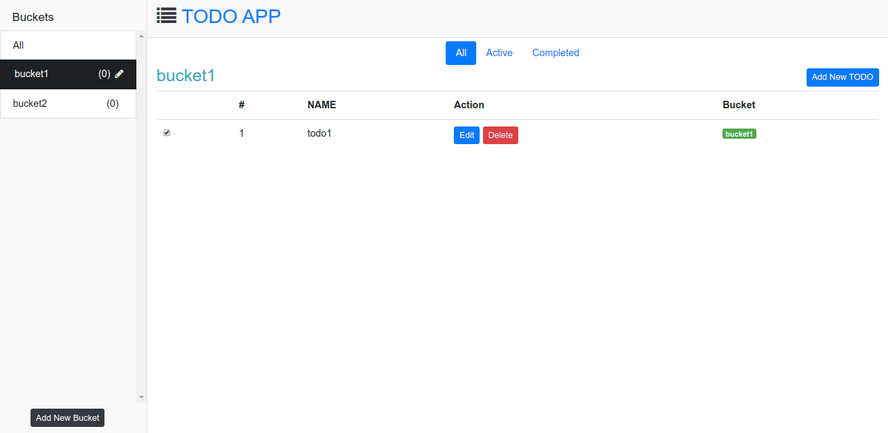
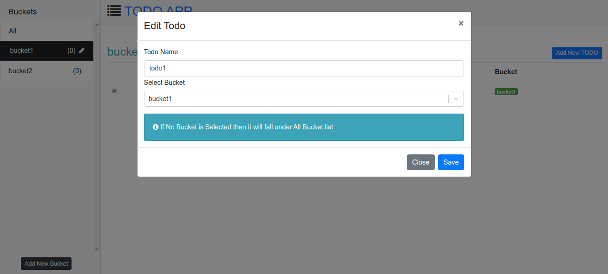
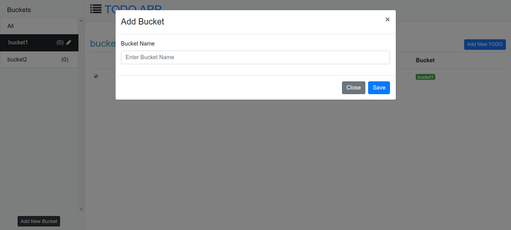

# React-Redux-TodoApp
App Created by using React , Redux , Thunk, Bootstrap , Json Server

# TODO APP

Start application

1. npm install
2. npm run api (to run JSON server) port 3000
3. npm start (to run Development server) port 9000

# used Technologies and framoworks 
- React 
- Redux 
- redux-thunk 
- create-react-app cli 
- JSON server for database
